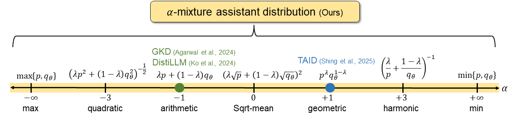

# AMiD: Knowledge Distillation for LLMs with -mixture Assistant Distribution [ICLR 2026] 

| [arxiv](https://arxiv.org/pdf/2510.15982) | [Openreview](https://openreview.net/forum?id=7WPJ0EgPdW) | Poster |

This repository contains an official PyTorch implementation for the paper [AMiD: Knowledge Distillation for LLMs with -mixture Assistant Distribution](https://arxiv.org/abs/2510.15982) in ICLR 2026.

**[Donghyeok Shin](https://sdh0818.github.io/), [Yeongmin Kim](https://sites.google.com/view/yeongmin-space/), [Suhyeon Jo](https://aai.kaist.ac.kr/bbs/board.php?bo_table=sub2_1&wr_id=10), [Byeonghu Na](https://sites.google.com/view/byeonghu-na), and [Il-Chul Moon](https://aai.kaist.ac.kr/)**   

## Overview

> **Abstract** *Autoregressive large language models (LLMs) have achieved remarkable improvement across many tasks but incur high computational and memory costs. Knowledge distillation (KD) mitigates this issue by transferring knowledge from a large teacher to a smaller student through distributional alignment. Previous studies have proposed various discrepancy metrics, but the capacity gap and training instability caused by near-zero probabilities, stemming from the high-dimensional output of LLMs, remain fundamental limitations. To overcome these challenges, several approaches implicitly or explicitly incorporating assistant distribution have recently been proposed. However, the past proposals of assistant distributions have been a fragmented approach without a systematic investigation of the interpolation path and the divergence. This paper proposes α-mixture assistant distribution, a novel generalized family of assistant distributions, and α-mixture distillation, coined AMiD, a unified framework for KD using the assistant distribution. The α-mixture assistant distribution provides a continuous extension of the assistant distribution by introducing a new distribution design variable α, which has been fixed in all previous approaches. Furthermore, AMiD generalizes the family of divergences used with the assistant distributions based on optimality, which has also been restricted in previous works. Through extensive experiments, we demonstrate that AMiD offers superior performance and training stability by leveraging a broader and theoretically grounded assistant distribution space.*

## Getting Started
To be updated.

## Citation
If you find the code useful for your research, please consider citing our paper.
```bib
@inproceedings{
shin2026amid,
title={{AM}iD: Knowledge Distillation for {LLM}s with \${\textbackslash}alpha\$-mixture Assistant Distribution},
author={Donghyeok Shin and Yeongmin Kim and Suhyeon Jo and Byeonghu Na and Il-chul Moon},
booktitle={The Fourteenth International Conference on Learning Representations},
year={2026},
url={https://openreview.net/forum?id=7WPJ0EgPdW}
}
```
 